# System Architecture and Data Flow

## System Overview
HealthLens AI is a multi-agent application built to analyze food products and provide health-conscious insights based on a user's health profile.

The system is composed of three main layers:
1. **Frontend**: A React Native (Expo) mobile application.
2. **Backend Services**: A FastAPI server that orchestrates the workflow and provides real-time progress updates via Server-Sent Events (SSE).
3. **AI Services Layers**: Utilizes Azure AI Content Understanding for OCR/Entity extraction, and Azure AI Foundry for specialized multi-agent analysis.

## Core Data Flows

### 1. Image Analysis Pipeline (`POST /api/analyze`)
This is the primary workflow where a user scans a food product. The process is orchestrated by FastAPI and streamed back to the client.

1. **Image Upload**: The client sends the food image and an optional `healthNote`.
2. **Content Extraction**: The `content_understanding` module processes the image to extract the product name, brand, and nutritional facts (calories, sugar, fat, etc.).
3. **Multi-Agent Evaluation**: The extracted JSON and health note are dispatched concurrently to five distinct Azure AI Foundry agents, each evaluating the product from their specialized domain:
   - 🧑‍⚕️ Doctor Agent (Clinical risks)
   - 🥗 Nutritionist Agent (Dietary value)
   - 🧪 Food Chemist Agent (Chemical and additive analysis)
   - 🏋️ Fitness Coach Agent (Impact on physical goals)
   - 🏥 Health Specialist Agent (General health advising)
4. **Synthesis**: The `conclusionAdvisor-agent` receives the original extracted text along with the five expert reports and computes the final JSON verdict (safe, caution, avoid), generating a summary and identifying critical alerts.
5. **Result Delivery**: The synthesized data and agent outputs are compiled and streamed back to the frontend.

### 2. Follow-Up Chat (`POST /api/followup`)
After an analysis is complete, the user can ask questions about the product.

1. **Context Submission**: The client submits their question, the chat history, and the full "Result JSON" from the original scan (acting as a "cheat sheet").
2. **Chat Hat Invocation**: The `conclusionAdvisor-agent` is invoked with a special "Chat Hat" system prompt. It is instructed to answer conversationally using only the provided scan data, avoiding the need to re-scan the image or re-invoke the other agents.
3. **Response**: The agent returns a rich, empathetic, text-based response.

## Architecture Diagram

```mermaid
graph TD
    %% Define styles
    classDef frontend fill:#3498db,stroke:#2980b9,stroke-width:2px,color:#fff
    classDef backend fill:#2ecc71,stroke:#27ae60,stroke-width:2px,color:#fff
    classDef azure fill:#9b59b6,stroke:#8e44ad,stroke-width:2px,color:#fff
    classDef agent fill:#f1c40f,stroke:#f39c12,stroke-width:2px,color:#333
    classDef user fill:#e74c3c,stroke:#c0392b,stroke-width:2px,color:#fff

    User((User)):::user
    App["📱 React Native App (Expo)"]:::frontend
    
    User -->|Uploads Food Image & Health Note| App
    User -->|Asks Follow-up Questions| App

    subgraph "Backend System (FastAPI)"
        API["FastAPI Orchestrator"]:::backend
        SSE["SSE Event Stream"]:::backend
    end

    App -->|POST /api/analyze| API
    App -->|POST /api/followup| API
    API -->|Streams Progress & Final Result| SSE
    SSE --> App

    subgraph "Azure AI Services"
        CU["📄 Content Understanding (OCR/Extraction)"]:::azure
        
        subgraph "Azure AI Foundry (Multi-Agent)"
            A1(("🧑‍⚕️ Doctor")):::agent
            A2(("🥗 Nutritionist")):::agent
            A3(("🧪 Chemist")):::agent
            A4(("🏋️ Fitness")):::agent
            A5(("🏥 Health Specialist")):::agent
            
            Conc(("🤖 Conclusion Advisor")):::agent
        end
    end

    %% Analysis flow
    API -->|1. Sends Image| CU
    CU -->|2. Returns Nutrition JSON| API
    API -->|3. Dispatches Data Parallelly| A1
    API -->|3. Dispatches Data Parallelly| A2
    API -->|3. Dispatches Data Parallelly| A3
    API -->|3. Dispatches Data Parallelly| A4
    API -->|3. Dispatches Data Parallelly| A5
    
    A1 & A2 & A3 & A4 & A5 -->|4. Expert Reports| API
    API -->|5. Forwards to Synthesizer| Conc
    Conc -->|6. Computes Final Verdict JSON| API
    
    %% Follow-up flow

    API -.->|Follow-up: Injects 'Cheat Sheet' JSON| Conc

    Conc -.->|Chat Hat Response| API
```

## Code Level Breakdown: Backend Services

The FastAPI backend acts as the orchestrator of this system. It relies heavily on two main Python modules: `content_understanding.py` (which extracts data from images) and `server.py` (which handles the API endpoints and the multi-agent AI pipeline).

### 1. `backend/content_understanding.py`
This module is responsible for the very first step in the pipeline: turning a raw food image into structured nutritional data (JSON). It attempts to use Azure AI Content Understanding first, and if that fails to extract readable text, it falls back to a GPT-4o Vision model.

**Key Functions:**
- **`analyze_food_image(image_bytes: bytes, mime_type: str) -> dict`**: The main entry point. It receives the raw image binary. It first calls `_get_client().begin_analyze_binary(...)` to send the image to Azure Content Understanding. If the returned data `_flatten_cu_response(raw)` is empty or mostly blank (e.g., failed to read a blurry label), it triggers the `_analyze_with_vision(image_bytes, mime_type)` fallback.
- **`_analyze_with_vision(image_bytes: bytes, mime_type: str) -> dict`**: The fallback method. It encodes the image to Base64 and sends it to the `gpt-4o` deployment via the `AzureOpenAI` client. It uses a strict system prompt instructing the model to act as a "food label analysis expert" and forces it to output a specific JSON structure (product name, brand, ingredients, nutrition facts, claims, warnings).
- **`_flatten_cu_response(raw: dict) -> dict`** & **`_extract_field_value(field: dict)`**: These are crucial data-wrangling functions. Azure Content Understanding returns a heavily nested hierarchy of objects (e.g., `contents -> fields -> type/valueString`). `_flatten_cu_response` recursively traverses this Azure-specific payload and extracts the actual values to produce a clean, flat, one-dimensional dictionary that the rest of the application can easily consume.

### 2. `backend/server.py`
This is the FastAPI application server. It defines the API endpoints, orchestrates the parallel execution of the AI agents, and manages real-time event streaming to the frontend.

**Key Global Configurations:**
- **`_project_client` & `_openai_client`**: Singleton instances of the Azure AI Foundry SDK (`AIProjectClient`), initialized via `DefaultAzureCredential`. 
- **`AGENTS` (List)**: A configuration list defining the names and versions of the 5 specialized Azure Foundry agents (Doctor, Nutritionist, Chemist, Fitness, Health Specialist) being utilized.
- **`CONCLUSION_AGENT`**: The agent responsible for synthesizing the 5 individual reports into a final verdict.

**Core Endpoints:**
- **`@app.post("/api/analyze")`**: 
  - **Functionality**: The primary pipeline endpoint. It acts as a generator, yielding JSON payloads disguised as Server-Sent Events (SSE). This allows the frontend to show real-time progress (e.g., "Reading the label...", "Dr. Patel is analyzing...").
  - **Flow Control**:
    1. Extracts the uploaded file and `healthNote`.
    2. Calls `analyze_food_image` (from `content_understanding.py`) to get the `food_data`.
    3. Builds a `task_prompt` string combining the extracted `food_data` JSON and the `healthNote`.
    4. **Parallelism**: Uses `asyncio.to_thread` to map `_call_foundry_agent` over the 5 `AGENTS` lists. This kicks off 5 concurrent network requests to Azure AI Foundry, drastically reducing the total processing time.
    5. Awaits all 5 agent responses (`asyncio.as_completed`), yielding SSE progress events as each agent finishes.
    6. Formats all 5 responses + the original text into a `conclusion_prompt` and sends it to the `CONCLUSION_AGENT` to get the final JSON summary and verdict.
    7. Calls `_build_result_from_responses` to package everything into the standardized JSON schema expected by the React Native app, and yields the final "done" event.

- **`@app.post("/api/followup")`**: 
  - **Functionality**: Handles subsequent user chat questions about the scanned food product.
  - **The "Cheat Sheet" Pattern**: Instead of re-analyzing the image, the frontend sends the *entire* parsed Result JSON (`payload.scan_context`) alongside the chat history and new message.
  - **The "Two Hats" Pattern**: The endpoint completely ignores the 5 sub-agents. It only invokes the `CONCLUSION_AGENT`, but it drastically overrides the agent's behavior by injecting `CHAT_HAT_SYSTEM_PROMPT`. This prompt commands the agent to stop outputting JSON verdicts and instead act as a warm, conversational medical advisor. It injects the `scan_context` as a mocked "user message" so the agent immediately knows everything about the food before answering the real chat query.

**Helper Functions:**
- **`_call_foundry_agent(agent_def: dict, prompt: str) -> dict`**: A critical wrapper around the Azure AI SDK. It sends the prompt to a specific agent using `_openai_client.responses.create` with the `agent_reference` pattern. Importantly, it contains a 5-iteration loop to handle **MCP (Model Context Protocol) tool approval requests**. If an Azure agent requires access to an external tool or knowledge base to finish its analysis, it pauses and requests approval; this function intercepts those requests, automatically approves them (`"approve": True`), and resubmits the response to let the agent continue generating.
- **`_build_result_from_responses(food_data, agent_responses, summary_text, has_health_note) -> dict`**: The final data formatter. It parses the JSON text outputted by the `conclusionAdvisor-agent`, extracts the colors for the "verdict" (Red -> Avoid, Green -> Safe), maps the pills (Calories, Sugar, Fat) from the raw CU dictionary, and constructs the exactly shaped dictionary the React Native UI requires to render the result screen.
- **`_extract_product_name(food_data: dict) -> str`** & **`_parse_nutrition(food_data: dict) -> list[dict]`**: Regex and dictionary-traversal heavy functions that try to safely extract a readable string for the product name and standard nutritional pills from the incredibly varied shapes that `content_understanding.py` might return.
